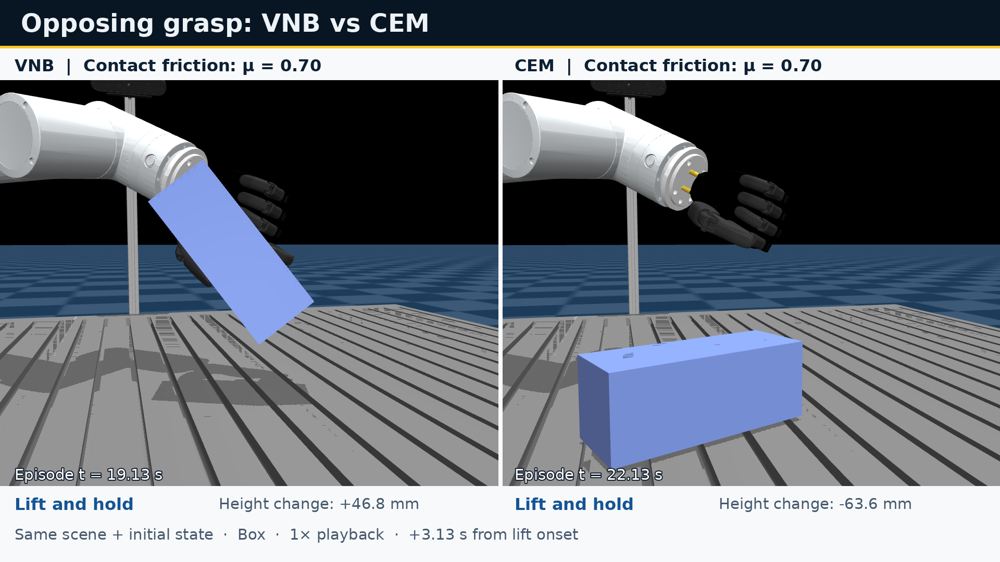

# Grasp-and-Lift Comparison: VNB vs CEM

[Watch the full-resolution video](comparison.mp4) · [Animated preview](comparison.gif)

VNB is on the left and CEM is on the right. Both controllers use the same box, scene, physical initial state, friction coefficient (μ = 0.70), and contact model in MuJoCo 3.4.0. Both panels retain the original hand and thumb colors. Playback runs at real time and aligns lift onset; the separate episode clocks reflect different acquisition durations. The displayed controller initialization uses seed 42.

For this selected grasp, VNB holds the object for six seconds while CEM drops it during lifting. Four controller initialization conditions give the following outcomes. They share the same physical initial state.

| Seed | VNB height change | CEM height change | VNB lift | CEM lift |
| --- | ---: | ---: | --- | --- |
| 42 | +47.0 mm | −63.6 mm | Successful | Failed |
| 123 | +47.3 mm | −61.3 mm | Successful | Failed |
| 456 | +46.9 mm | −64.1 mm | Successful | Failed |
| 789 | +46.8 mm | −63.2 mm | Successful | Failed |

Height change is measured from lift onset. No external disturbance acts during the displayed lift and hold. All 301 recorded VNB hold frames per run have loaded distal-thumb contact opposing a distal finger, without table or palm support. [Validation results](validation.json) record the matched initial states, model hashes, outcomes, and contact checks.

## Experiment context

This additional demonstration uses a RealHand dataset box preshape (candidate 82 from `realhand_o6_iron_hw_v2/candlog_graspit_box.jsonl`) and recovered March 1 controller code. The box measures approximately 62.5 × 62.5 × 162.5 mm. It remains free throughout acquisition, lifting, and the six-second hold. Both methods use the same preshape, 90° world yaw, fixed inactive objects, and 2.0 N·m hand motor limit. Thumb yaw and dataset-inactive fingers are held at their preshape values; active flexion has no extra cap.

The grasp was selected after exploratory trials. These four repeats describe this selected grasp and contact model; they are separate from the paper's aggregate benchmark. The recovered controllers retain their original differences in action scoring, stopping, and VNB tightening, and load no trained belief checkpoint. The comparison therefore does not isolate the effect of belief learning or CVaR gradients.

The stock soft-contact model allows up to 5.98 mm hand/object overlap, with proximal thumb contact contributing up to 18.6% of summed hand normal force. Shared stiffer-contact settings can make both methods retain the object. These contact-model effects limit how the observed difference transfers to other configurations.

## Media

- `comparison.mp4`: original 1920 × 1080, 30 fps H.264 video, 7.70 seconds, silent.
- `comparison.gif`: 960 × 540, 20 fps looping preview of the same full interval.
- `poster.png`: full-resolution preview still.
- `render_manifest.json`: camera, alignment, and all 462 panel-frame mappings to recorded states. The source run identifiers refer to archived recordings; raw trajectories and binary models are not included in this media bundle.
- `validation.json`: complete four-pair validation summary.
- `checksums.json`: SHA-256 checksums for this bundle.

The video uses recorded MuJoCo states without synthesized motion or within-trajectory time warping. The GIF only changes spatial resolution and frame sampling for README playback.
